# Lab 03: Administrar recursos de Azure con ARM y Bicep
 
 
 
 
 
 


## Índice

1. [Descripción](#1-descripción)  
2. [Escenario del laboratorio](#2-escenario-del-laboratorio)  
3. [Habilidades adquiridas](#3-habilidades-adquiridas)  
4. [Tareas principales](#4-tareas-principales)  
   - [Crear una plantilla de Azure Resource Manager (ARM)](#tarea-1-crear-una-plantilla-arm)  
   - [Editar y volver a implementar una plantilla ARM](#tarea-2-editar-y-redeployar-la-plantilla-arm)  
   - [Configurar Cloud Shell y desplegar con PowerShell](#tarea-3-configurar-cloud-shell-y-desplegar-con-powershell)  
   - [Desplegar con CLI](#tarea-4-desplegar-un-recurso-con-cli)  
   - [Desplegar un recurso con Bicep](#tarea-5-desplegar-un-recurso-con-bicep)  
5. [Diagrama del Laboratorio](#5-diagrama-del-laboratorio)
6. [Costo Total del Laboratorio](#costo-total-del-laboratorio)
7. [Desarrollo del laboratorio](#7-desarrollo-del-laboratorio)  
   - [Tarea 1: Crear una plantilla ARM](#tarea-1-crear-una-plantilla-arm)  
   - [Tarea 2: Editar y redeployar la plantilla ARM](#tarea-2-editar-y-redeployar-la-plantilla-arm)  
   - [Tarea 3: Configurar Cloud Shell y desplegar con PowerShell](#tarea-3-configurar-cloud-shell-y-desplegar-con-powershell)  
   - [Tarea 4: Desplegar un recurso con CLI](#tarea-4-desplegar-un-recurso-con-cli)  
   - [Tarea 5: Desplegar un recurso con Bicep](#tarea-5-desplegar-un-recurso-con-bicep)  
   - [Tarea 6: Limpiando Recursos](#tarea-6-limpiando-recursos)  
8. [Resultados esperados](#8-resultados-esperados)  
9. [Resultado final](#9-resultado-final)  
10. [Contribuciones](#10-contribuciones)  
11. [Licencia](#11-licencia)  

---

## 1. Descripción

Este laboratorio corresponde al módulo **AZ-104 Microsoft Azure Administrator**, específicamente el **Lab 03: Manage Azure resources by using Azure Resource Manager Templates**.  
Los laboratorios oficiales se encuentran disponibles en [Microsoft Learning Labs AZ-104](https://microsoftlearning.github.io/AZ-104-MicrosoftAzureAdministrator/).  

El objetivo es practicar la **automatización de despliegues de recursos en Azure** mediante el uso de **plantillas ARM (Azure Resource Manager)** y **Bicep**, explorando diferentes métodos de implementación: portal, PowerShell, CLI y Bicep.  

En este laboratorio se refuerzan los fundamentos de la **infraestructura como código (IaC)**, mostrando cómo las organizaciones pueden reducir la carga administrativa, minimizar errores humanos y garantizar la consistencia en sus entornos de nube. Se introduce el concepto de **plantillas ARM en formato JSON**, que permiten definir recursos de manera declarativa, y se contrasta con **Bicep**, un lenguaje más moderno y simplificado que ofrece ventajas en legibilidad, reutilización y seguridad de tipos.  

Además, se explora el uso de **Cloud Shell** como entorno interactivo para ejecutar despliegues tanto con **Azure PowerShell** como con **Azure CLI**, reforzando la importancia de dominar múltiples herramientas de automatización. Este enfoque es esencial en escenarios empresariales donde la escalabilidad, la reproducibilidad y la trazabilidad de los despliegues son prioritarias.  

El laboratorio también destaca la capacidad de **exportar plantillas directamente desde el portal**, lo que permite reutilizar configuraciones y acelerar la creación de nuevos recursos. Al combinar portal, ARM, CLI y Bicep, se establece un marco sólido de administración que complementa otras prácticas de seguridad y gobernanza como **RBAC y Azure Policy**.

## 2. Escenario del laboratorio

La organización busca formas de simplificar y automatizar los despliegues de recursos en Azure. Se requiere crear discos administrados y desplegarlos mediante diferentes enfoques: portal, PowerShell, CLI y Bicep.

## 3. Habilidades adquiridas

- Creación y exportación de plantillas ARM.  
- Edición y reutilización de plantillas.  
- Uso de Azure Cloud Shell con PowerShell y CLI.  
- Despliegue de recursos con Bicep.  
- Validación y monitoreo de despliegues.  

## 4. Tareas principales

1. Crear un disco administrado y exportar la plantilla ARM.  
2. Editar la plantilla ARM y redeployar.  
3. Configurar Cloud Shell y desplegar con PowerShell.  
4. Desplegar con CLI.  
5. Desplegar un recurso usando Bicep.  

## 5. Diagrama del Laboratorio

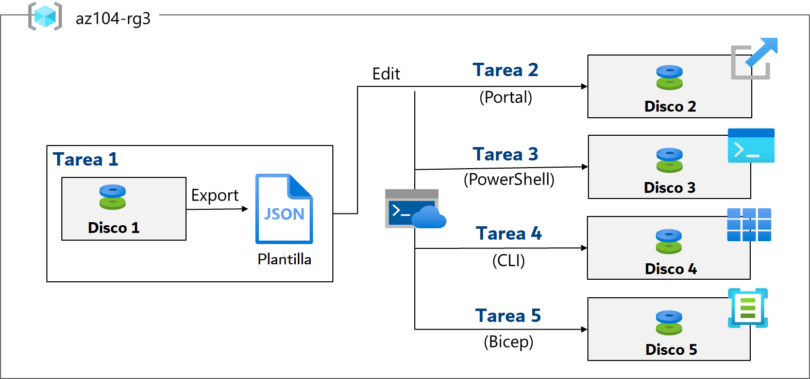

- **Tarea 1:** Crear una plantilla de Azure Resource Manager (ARM).  
- **Tarea 2:** Editar una plantilla de Azure Resource Manager y volver a implementarla.  
- **Tarea 3:** Configurar Cloud Shell y desplegar una plantilla con Azure PowerShell.  
- **Tarea 4:** Desplegar una plantilla con la CLI.  
- **Tarea 5:** Desplegar un recurso utilizando Azure Bicep.  

---

## Costo Total del Laboratorio

Usando la calculadora de precios de Azure, se obtiene el siguiente costo para todos los recursos creados en este laboratorio:

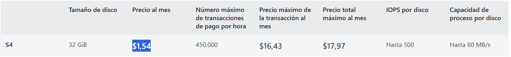  
> **NOTA**  
> El costo total **mensual** de una unidad HDD S4 de 32 GiB es de **USD 1,54**. Asumiendo que sólo crearemos el recurso para luego eliminarlo, no necesitamos considerar el costo por transacciones.

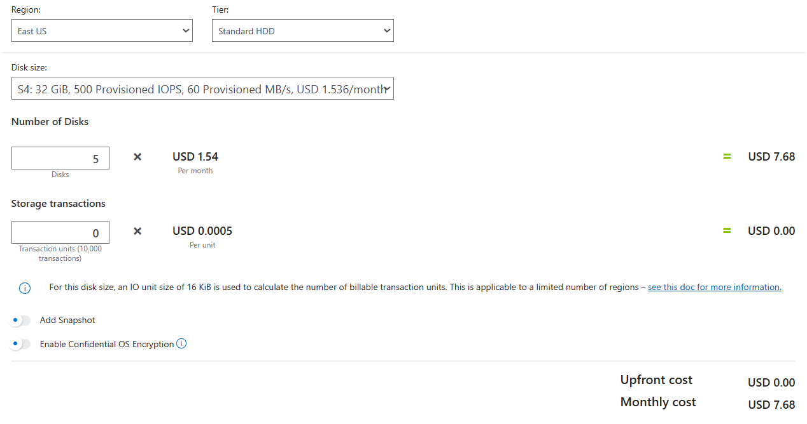  
> **NOTA**  
> Al tener **5 discos administrados HDD S4 de 32 GiB**, el valor final mensual es de **USD 7,68**.  
> Este monto depende de la cantidad de transacciones por hora. En nuestro caso, como los discos no tendrán mayor uso que el de su creación, el cálculo aproximado por hora se obtiene dividiendo el costo mensual entre 30 días y 24 horas:  
> **USD 7,68 ÷ (30 × 24) ≈ USD 0,011 por hora**.

---

## 7. Desarrollo del laboratorio

### Tarea 1: Crear una plantilla ARM

1. Iniciamos sesión en el portal de Azure - [https://portal.azure.com](https://portal.azure.com).  
2. Buscamos y seleccionamos **Discos**.
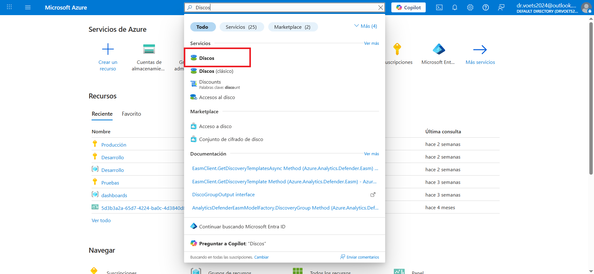
3. En la página de **Discos**, seleccionamos **Crear**.  
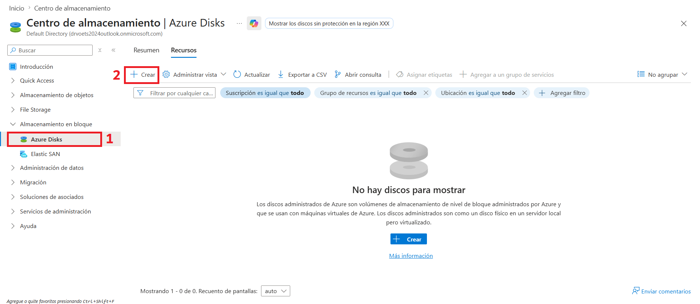
4. En la página **Crear un disco administrado**, configuramos el disco y luego seleccionamos **Ok**.  

   | Configuración       | Valor |
   |---------------------|-------|
   | Subscription        | your subscription |
   | Resource Group      | az104-rg3 (Si es necesario, selecciona Create new.) |
   | Disk name           | az104-disk1 |
   | Region              | East US |
   | Availability zone   | No infrastructure redundancy required |
   | Source type         | None |
   | Performance         | Standard HDD (change size) |
   | Size                | 32 Gib |
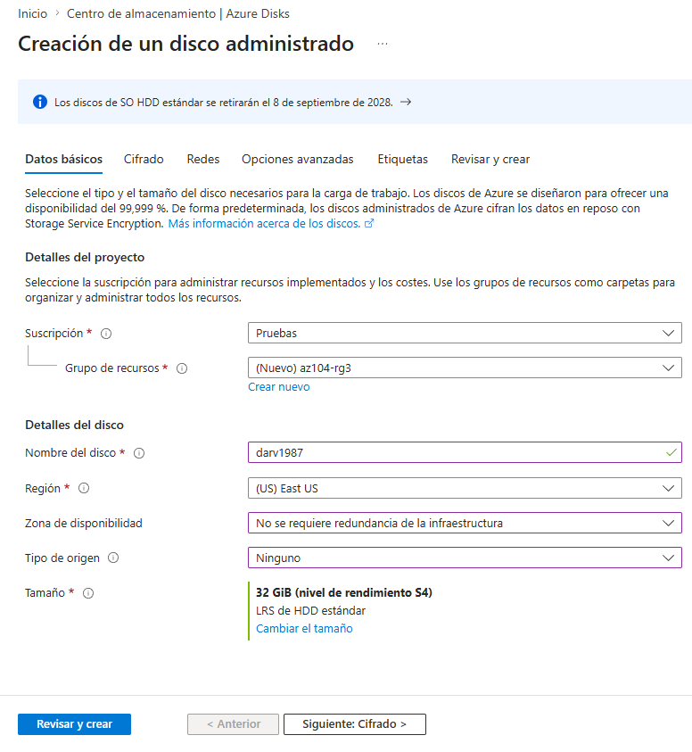

   >💡 **Nota:**
   >
   >Estamos creando un disco administrado simple para que podamos practicar con plantillas. Los discos administrados de Azure son volúmenes de almacenamiento a nivel de bloque que son administrados por Azure.  

5. Hacemos clic en **Revisar y crear** y luego seleccionamos **Crear**.
6. Monitoreamos las notificaciones (arriba a la derecha) y después del despliegue seleccionamos **Ir al recurso**.
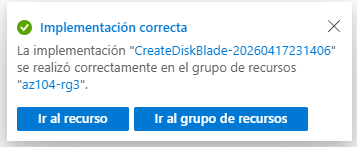
7. En el panel de **Automatización**, seleccionamos **Exportar plantilla**.
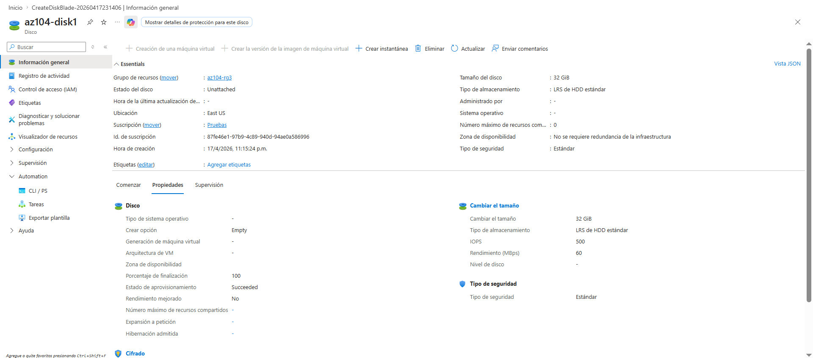
8. En la sección **Plantilla**, hacemos clic en **ARM Template** y **Descargar** y guardamos la plantilla en el disco local. Luego cambiamos a la sección **Parámetros** y hacemos lo mismo.
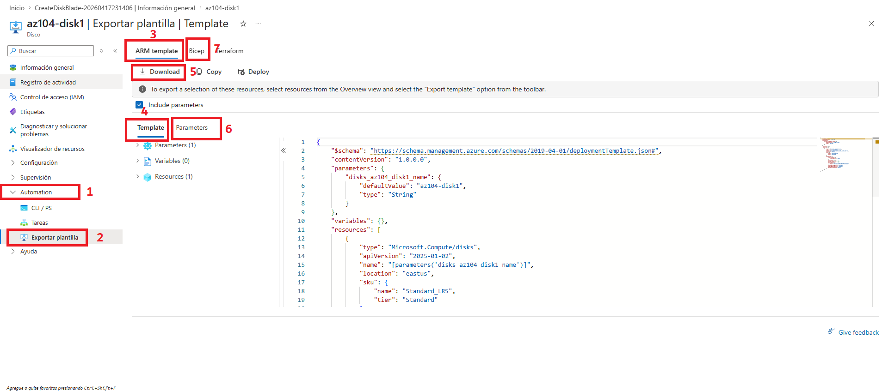
9. Usamos el Explorador de archivos para abrir la carpeta **Descargas** en nuestro computador. Observaremos que hay dos archivos JSON (template y parameters).  

>💡 **¿Sabías que?**
>
>Podemos exportar un grupo de recursos completo o solo recursos específicos dentro de ese grupo de recursos.

---

### Tarea 2: Editar y redeployar la plantilla ARM

1. En esta tarea, usaremos la plantilla descargada para desplegar un nuevo disco administrado. Esta tarea describe cómo repetir despliegues rápida y fácilmente.  
2. En el portal de Azure, buscamos y seleccionamos **Implementar una plantilla personalizada**.
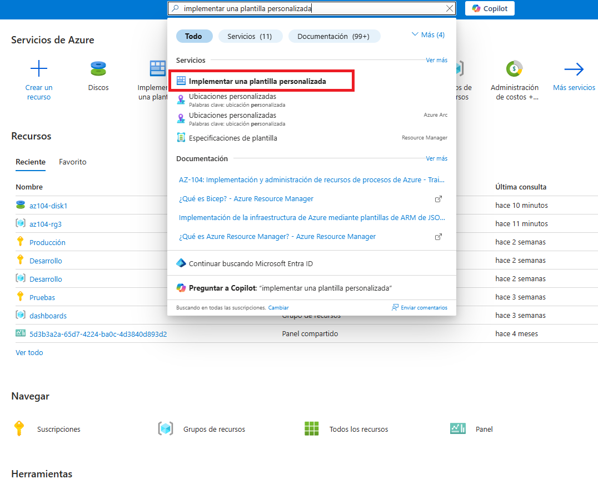 
3. En el panel seleccionamos **Cree su propia plantilla en el editor**, observa que existe la posibilidad de usar varias **Plantillas comunes**. Hay muchas plantillas integradas como se muestra.
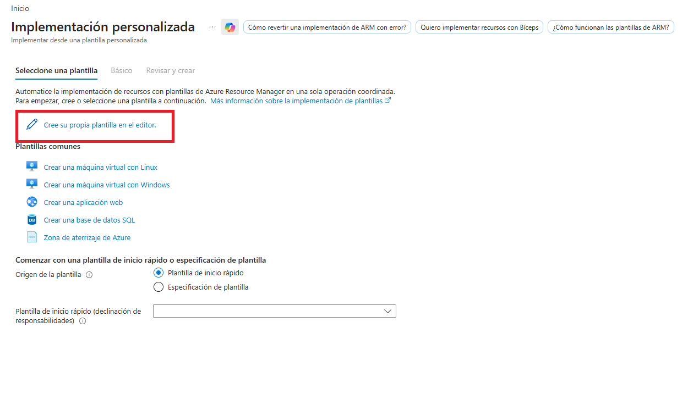  
4. En lugar de usar una Plantilla común, seleccionamos **Cree su propia plantilla en el editor**.  
5. En el **Editor**, hacemos clic en **Cargar archivo** y cargamos el archivo **template.json** que descargamos al disco local.
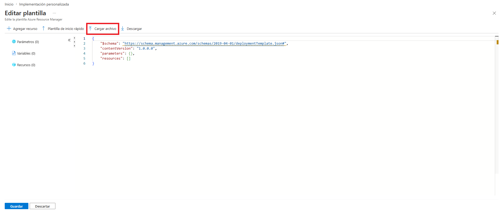  
6. Dentro del editor, realizamos estos cambios:  
   - Cambiamos `disks_az104_disk1_name` a `disk_name` (dos lugares para cambiar).  
   - Cambiamos `az104-disk1` a `az104-disk2` (un lugar para cambiar).  
   - Observamos que este es un disco Standard. La ubicación es **eastus**. El tamaño del disco es **32GB**.
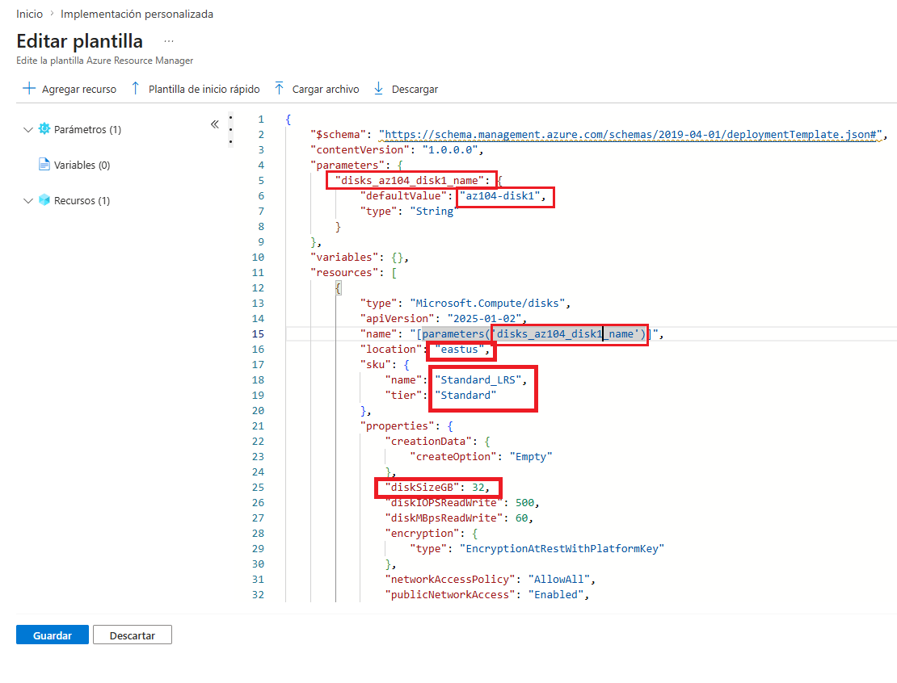
7. Guardamos los cambios.  
8. No olvidar el archivo de parámetros. Seleccionamos **Editar parametros**, hacemos clic en **Cargar Archivo** y cargamos el archivo **parameters.json**.
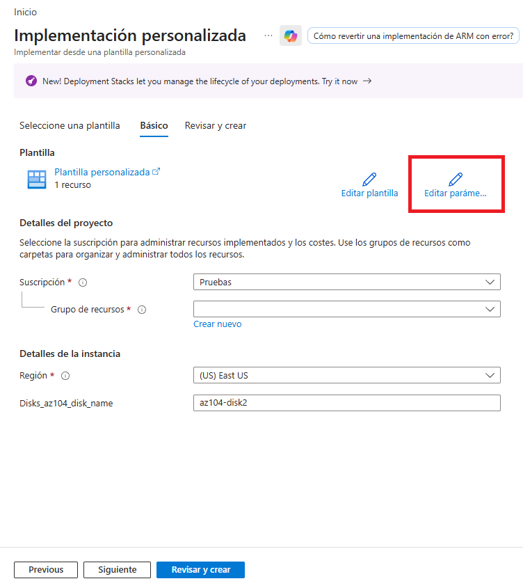
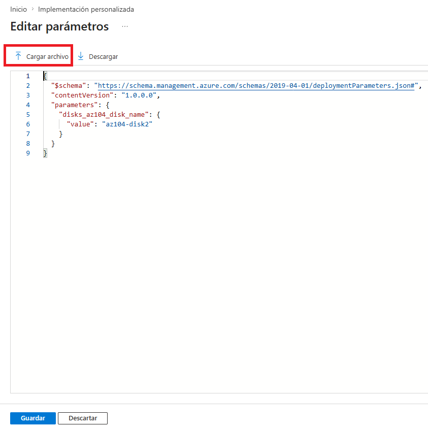
9. Realizamos este cambio para que coincida con el archivo de plantilla:  
   - Cambiamos `disks_az104_disk1_name` a `disk_name` (un lugar para cambiar).  
10. Guardamos los cambios.  
11. Completamos la configuración de la implementación personalizada:  

    | Configuración   | Valor          |
    |-----------------|----------------|
    | Subscription    | your subscription |
    | Resource Group  | az104-rg3 |
    | Region          | (US) East US |
    | Disk_name       | az104-disk2 |
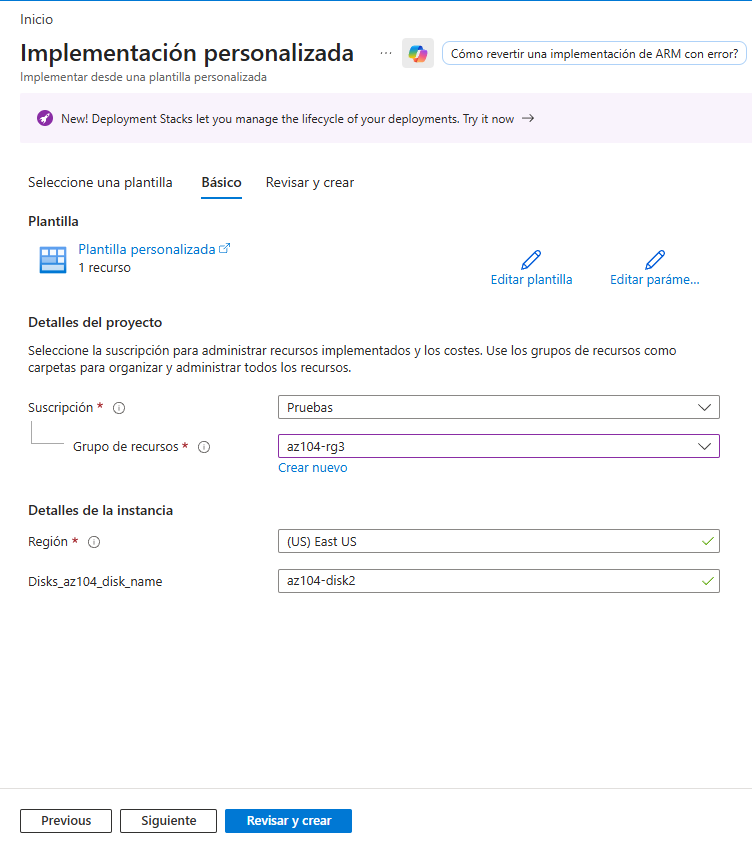

12. Seleccionamos **Revisar y crear** y luego seleccionamos **Crear**.
13. Seleccionamos **Ir al recurso**. Verificamos que se haya creado **az104-disk2**.
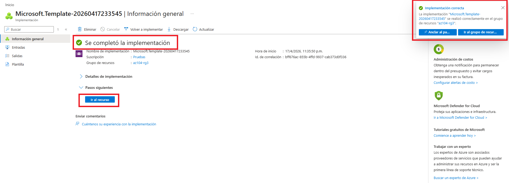
14. En el panel de **Información General**, seleccionamos el grupo de recursos **az104-rg3**. Ahora deberiamos tener dos discos.
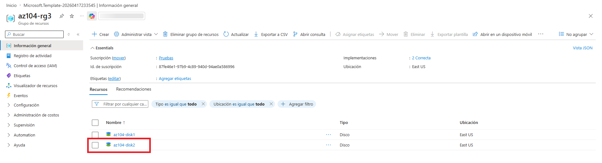
15. En la sección **Ajustes**, hacemos clic en **Implementaciones**.
16. Seleccionamos una implementación y revisamos el contenido de los paneles **Entrada** y **Plantilla**.  

> 💡 **Nota:**
>
> Todos los detalles de las implementaciones están documentados en el grupo de recursos. Es una buena práctica revisar las primeras implementaciones basadas en plantillas para asegurar el éxito antes de usar las plantillas en operaciones a gran escala.

---

### Tarea 3: Configurar Cloud Shell y desplegar con PowerShell

En esta tarea, trabajaremos con **Azure Cloud Shell** y **Azure PowerShell**. Azure Cloud Shell es una terminal interactiva, autenticada y accesible desde el navegador para administrar recursos de Azure. Proporciona la flexibilidad de elegir la experiencia de shell que mejor se adapte a nuestra forma de trabajar, ya sea Bash o PowerShell. En esta tarea, usaremos PowerShell para desplegar una plantilla.

1. Seleccionamos el ícono de **Cloud Shell** en la parte superior derecha del portal de Azure. Alternativamente, podemos navegar directamente a [https://shell.azure.com](https://shell.azure.com).  

2. Cuando se nos pida seleccionar entre Bash o PowerShell, seleccionamos **PowerShell**.

>💡 ¿Sabías que?
>
> Si trabajas principalmente con sistemas Linux, Bash (CLI) se siente más familiar. Si trabajas principalmente con sistemas Windows, Azure PowerShell se siente más familiar.  

>⚠️**Los pasos listados a continuación del 3 al 6 corresponden al primer uso en CloudShell, si ya hemos abierto CloudShell antes, estas opciones no saldrán.**

3. En la pantalla **Primeros pasos**, seleccionamos **Montar una cuenta de almacenamiento**, seleccionamos nuestra suscripción de cuenta de almacenamiento y luego seleccionamos **Aplicar**.  
4. Seleccionamos **Quiero crear una cuenta de almacenamiento** y luego **Siguiente**. Completamos la información para crear la cuenta de almacenamiento:  

   | Configuración                  | Valor |
   |--------------------------------|-------|
   | Resource Group                 | az104-rg3 |
   | Region                         | selecciona tu región |
   | Storage account (Create new)   | debe ser globalmente único, entre 3 y 24 caracteres de longitud y usar solo números y letras minúsculas |
   | File share (Create new)        | fs-cloudshell |

5. Cuando hayamos completado, seleccionamos **Crear**.  
6. Tomará un par de minutos aprovisionar el almacenamiento.  
7. Seleccionamos **Confoguración** (barra superior) y luego **Ir a la versión clásica**.
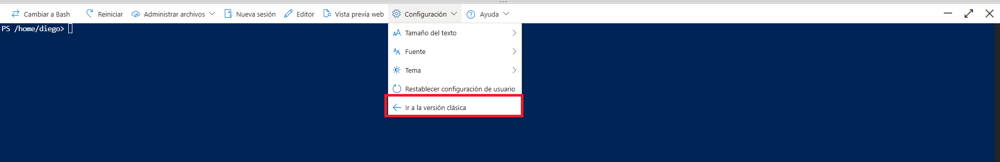
8. Seleccionamos el ícono **Cargar/Descargar Archivos** (barra superior) y luego seleccionamos **Subir**.  
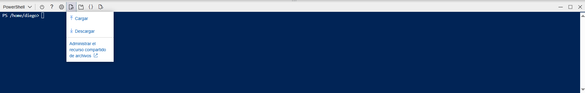
9. Subimos ambos archivos descargados previamente en la tarea anterior, la plantilla y los parámetros, desde el directorio **Descargas** de nuestro equipo local.
10. Seleccionamos el ícono del **Editor** (llaves `{}`) y navegamos al archivo JSON de la plantilla en el panel de navegación izquierdo.
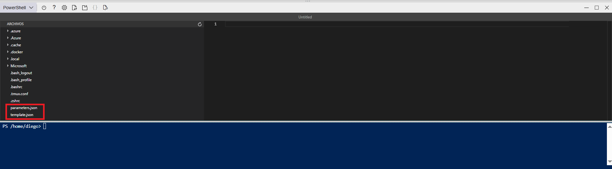
11. Realizamos un cambio. Por ejemplo, cambiamos el nombre del disco a **az104-disk3**. Usamos **Ctrl+S** para guardar nuestros cambios y luego **Ctrl+Q** para cerrar el editor.
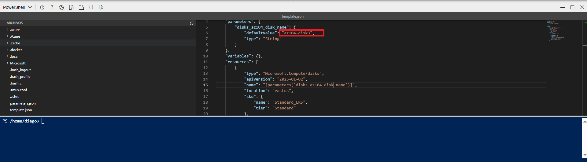
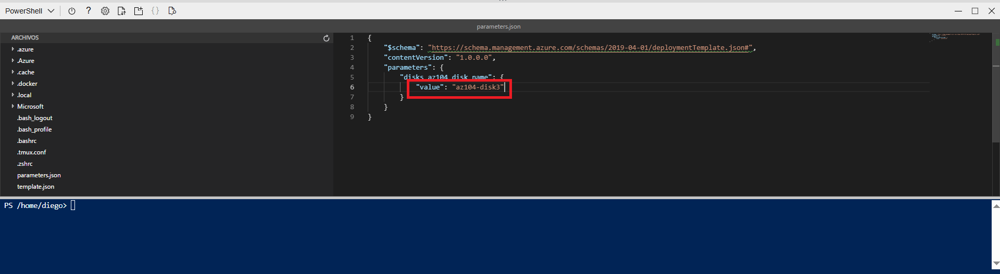

>💡 **Nota:**
>
>Podemos dirigir nuestro despliegue de plantilla a un grupo de recursos, suscripción, grupo de administración o tenant. Dependiendo del alcance del despliegue, usaremos diferentes comandos.

12. Para desplegar en un grupo de recursos, usaremos **New-AzResourceGroupDeployment**:

    ```powershell
    New-AzResourceGroupDeployment -ResourceGroupName az104-rg3 -TemplateFile template.json -TemplateParameterFile parameters.json
    ```

13. Nos aseguramos de que el comando se complete y que el **ProvisioningState** diga **Succeeded**.  
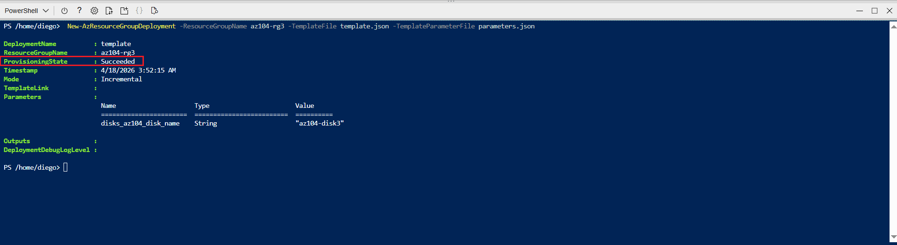

14. Confirmamos que el disco fue creado:  

    ```powershell
    Get-AzDisk | ft Name,ResourceGroupName,Location,DiskSizeGb,ProvisioningState
    ```

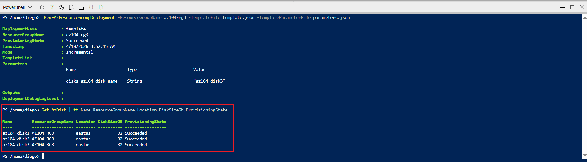

---

### Tarea 4: Desplegar un recurso con CLI

1. Continuamos en **Cloud Shell** pero esta vez seleccionamos **Bash**. Confirmamos nuestra elección.
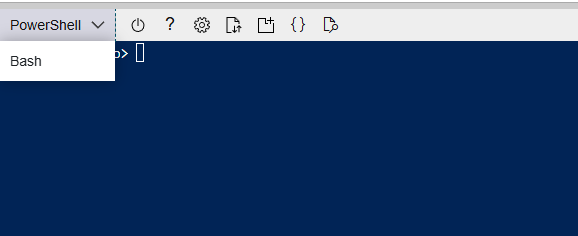
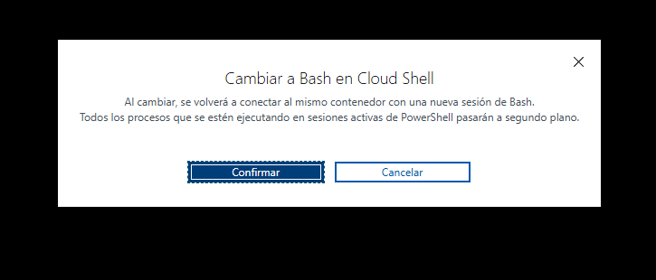
2. Verificamos que nuestros archivos estén disponibles en el almacenamiento de Cloud Shell. Si completamos la tarea anterior, nuestros archivos de plantilla deberían estar disponibles en la sesión.  

   ```bash
   ls
   ```
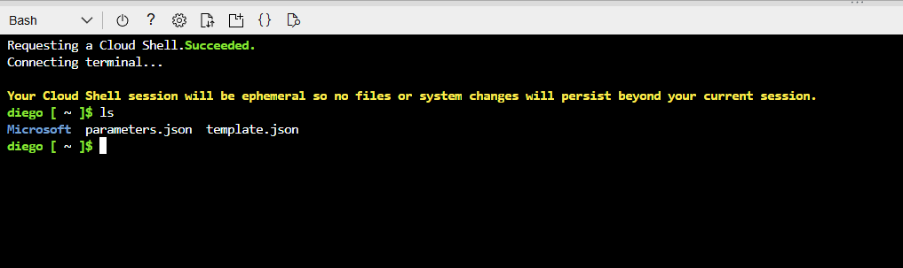

3. Seleccionamos el ícono del **Editor** (llaves `{}`) y navegamos al archivo JSON de la plantilla.  
4. Realizamos un cambio. Por ejemplo, cambiaremos el nombre del disco a **az104-disk4**. Usamos **Ctrl+S** para guardar nuestros cambios y luego **Ctrl+Q** para cerrar el editor.  
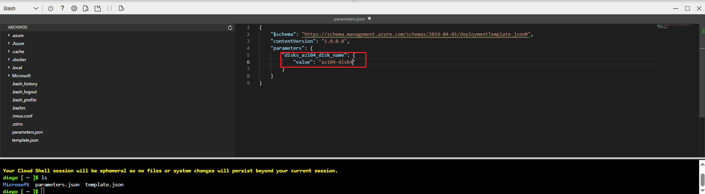

>💡 **Nota:**
>
>Podemos dirigir nuestro despliegue de plantilla a un grupo de recursos, suscripción, grupo de administración o tenant. Dependiendo del alcance del despliegue, usaremos diferentes comandos.

5. Para desplegar en un grupo de recursos, usaremos **az deployment group create**:  

   ```bash
   az deployment group create --resource-group az104-rg3 --template-file template.json --parameters parameters.json
   ```
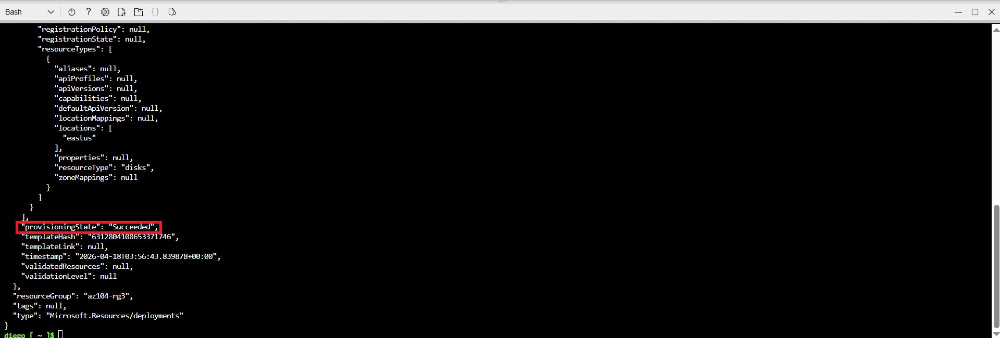

6. Nos aseguramos de que el comando se complete y que el **ProvisioningState** sea **Succeeded**.  
7. Confirmamos que el disco fue creado:  

   ```bash
   az disk list --resource-group az104-rg3 --output table
   ```

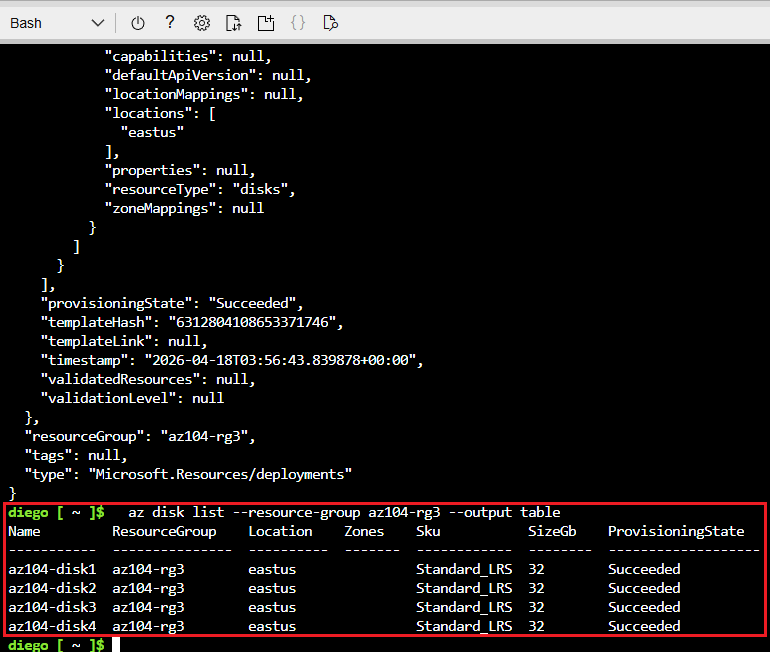

---

### Tarea 5: Desplegar un recurso con Bicep

En esta tarea, usaremos un archivo **Bicep** para desplegar un disco administrado. Bicep es una herramienta de automatización declarativa que está construida sobre plantillas ARM. 

1. Descargamos y descomprimimos el arhivo `AZ-104-MicrosoftAzureAdministrator-master.zip` ubicado en la [Página oficial de laboratorios AZ-104](https://microsoftlearning.github.io/AZ-104-MicrosoftAzureAdministrator/) y luego ubicamos el archivo `\Allfiles\Lab03\azuredeploydisk.bicep` de la carpeta LAB N° 3 ó también ubicado en este mismo repositorio.
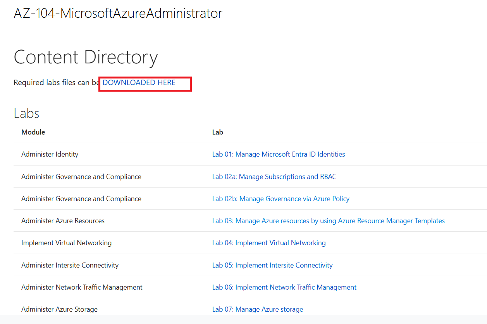.
2. Continuamos trabajando en **Cloud Shell** en una sesión de **Bash**.  
3. Seleccionamos **Administrar** y luego **Subir** para subir el archivo Bicep a Cloud Shell.
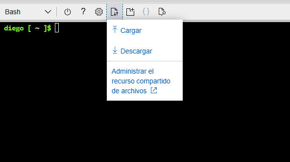
4. Hacemos clic en **Editor** y, cuando se te solicite, confirmamos el cambio a la **Classic Cloud Shell**.  
5. Seleccionamos el archivo **azuredeploydisk.bicep**.
6. Realizamos los siguientes cambios:
   - Cambiamos el valor de `managedDiskName`, línea 2, a **az104-disk5**.
   - Cambiamos el valor de `diskSizeinGiB`, línea 7, a **32**.
   - Cambiamos el valor de `sku name`, línea 26, a **StandardSSD_LRS**.
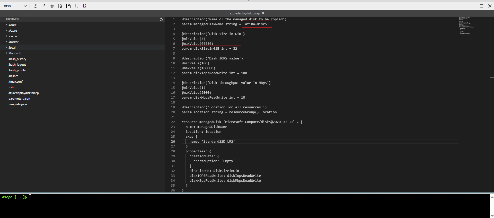
7. Usamos **Ctrl+S** para guardar nuestros cambios y luego **Ctrl+Q** para cerrar el editor.
8. Ahora, desplegamos la plantilla:

    ```bash
    az deployment group create --resource-group az104-rg3 --template-file azuredeploydisk.bicep
    ```
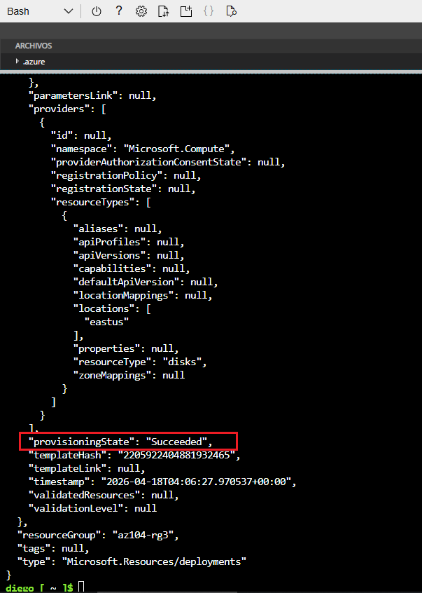

9. Confirmamos que el disco fue creado:  

    ```bash
    az disk list --resource-group az104-rg3 --output table
    ```
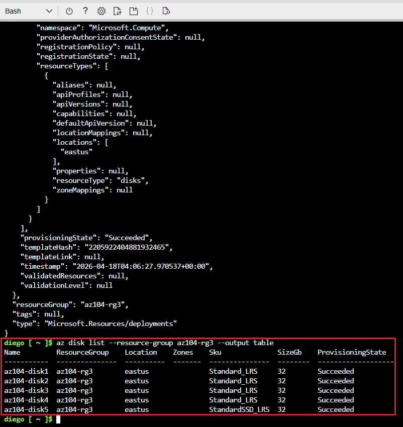

---

### Tarea 6: Limpiando Recursos

Si estamos trabajando con nuestra propia suscripción, nos tomaremos un minuto para eliminar los recursos del laboratorio. Esto asegurará que los recursos se liberen y que el costo se minimice.  
La forma más sencilla de eliminar los recursos del laboratorio es eliminar el grupo de recursos del laboratorio.  

1. En el portal de Azure:  
   - Seleccionamos el grupo de recursos.  
   - Seleccionamos **Eliminar este grupo de recursos**.  
   - Ingresamos el nombre del grupo de recursos.  
   - Hacemos clic en **Eliminar**.  
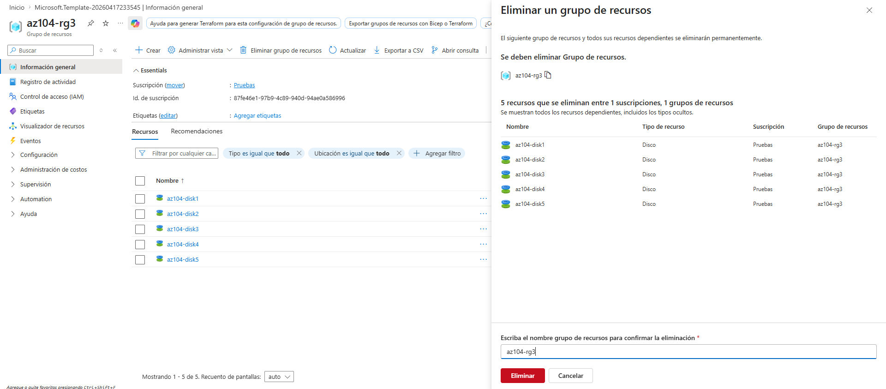

2. Usando **Azure PowerShell**:  

   ```powershell
   Remove-AzResourceGroup -Name resourceGroupName
   ```

3. Usando la **CLI**:  

   ```bash
   az group delete --name resourceGroupName
   ```

---

## 8. Resultados esperados

- Comprender cómo crear, editar y desplegar plantillas ARM.  
- Familiarizarse con el uso de Cloud Shell en PowerShell y Bash.  
- Implementar recursos con Bicep.  
- Validar despliegues y revisar detalles en el grupo de recursos.  

## 9. Resultado final

Al finalizar el laboratorio, se habrán desplegado **cinco discos administrados** en Azure, cada uno utilizando un método diferente:  

- Portal de Azure.  
- Plantilla ARM editada.  
- PowerShell.  
- CLI.  
- Bicep.  

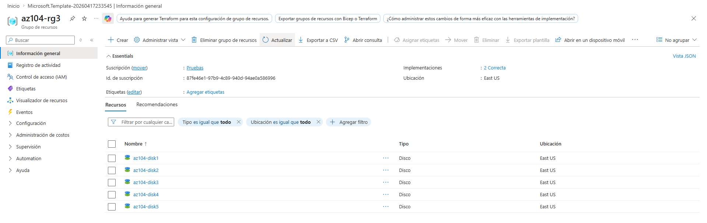

## 10. Contribuciones

Este README fue elaborado tomando como base el laboratorio oficial de Microsoft, traducido y adaptado al español para fines de práctica del examen **AZ-104**.

## 11. Licencia

Este documento se distribuye con fines educativos y de práctica. El contenido original pertenece a Microsoft. Traducción y adaptación realizada para uso personal y académico.
